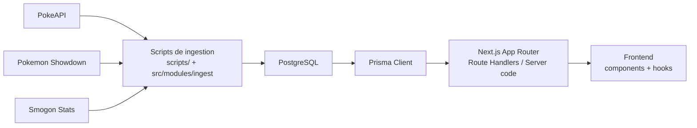
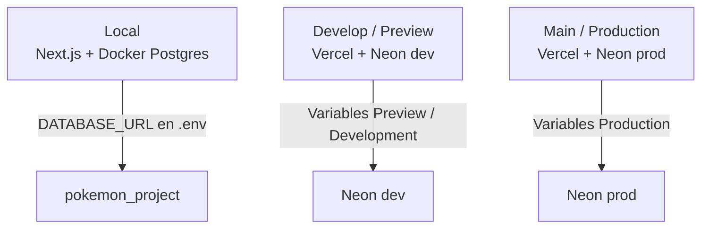

# Arquitectura

## Objetivo

La aplicacion usa una arquitectura de datos propia para desacoplar la UI de las APIs externas. La informacion estructural entra desde PokeAPI, la capa competitiva desde Pokemon Showdown y Smogon, y todo se normaliza en PostgreSQL mediante Prisma.

## Principio principal

El frontend no consume PokeAPI ni Showdown directamente.

```text
fuentes externas -> ingestion -> PostgreSQL -> Prisma -> backend interno -> frontend
```

## Flujo de datos





## Capas

### 1. Fuentes externas

- `PokeAPI`: dominio canonico de Pokemon
- `Pokemon Showdown`: formatos, tiers, learnsets competitivos y sample sets
- `Smogon Stats`: uso mensual por formato y rating

### 2. Ingestion

Responsable de:

- descargar datos externos
- mapear JSON a entidades normalizadas
- hacer `upsert` o resincronizacion controlada
- persistir `rawPayload` cuando conviene

Ubicacion principal:

- `scripts/ingest.ts`
- `src/modules/ingest/`

### 3. Persistencia

- `PostgreSQL` como fuente de verdad de la aplicacion
- `Prisma` como ORM y capa tipada de acceso
- `views SQL` para consultas de lectura mas limpias

Ubicacion principal:

- `prisma/schema.prisma`
- `prisma/migrations/`
- `src/lib/prisma.ts`

### 4. Backend interno

Responsable de:

- exponer rutas `/api/*`
- consultar Prisma
- devolver contratos estables a la UI

Ubicacion principal:

- `app/api/`
- `src/modules/pokemon/`
- `src/modules/pokedex/`
- `src/modules/team/`
- `src/modules/views/`
- `src/modules/openapi/`

### 5. Frontend

Responsable de:

- renderizar la Pokedex y las pantallas de equipos
- consumir solo la API interna o datos de servidor

Ubicacion principal:

- `app/components/`
- `app/hooks/`
- `app/lib/`

## Organizacion del repositorio

```text
app/
  api/                    Endpoints internos y Swagger
  components/             UI
  hooks/                  Hooks de consumo de la API interna
  lib/                    Helpers de frontend

prisma/
  schema.prisma           Modelo de datos Prisma
  migrations/             Migraciones SQL

scripts/
  ingest.ts               Punto de entrada de ingestion

src/
  lib/
    env.ts                Lectura tipada de variables de entorno
    prisma.ts             Cliente Prisma reusable
  modules/
    ingest/               Clientes, mappers y pasos de ingestion
    pokemon/              Consultas de Pokemon
    pokedex/              Consultas de pokedexes
    team/                 Logica del analisis de equipos
    views/                Consultas sobre views SQL
    openapi/              Especificacion Swagger/OpenAPI

docs/
  *.md                    Documentacion tecnica
  screenshots/            Capturas del proyecto
```

## Entornos





### Regla practica

- `localhost` con `.env` local usa la base Docker local
- el deployment de `develop` en Vercel usa la base cloud de `develop`
- el deployment de `main` en Vercel usa la base cloud de `production`

## Decisiones importantes

- Prisma se reutiliza mediante `src/lib/prisma.ts` para evitar multiples instancias del cliente
- Se guarda `rawPayload` en varias tablas grandes para reparsear o ampliar informacion en el futuro
- En tablas derivadas se usa resincronizacion controlada cuando es mas fiable que un `upsert` fila a fila
- La capa competitiva pesada de `usage_stat_monthly` no se carga en bases cloud gratuitas porque excede el limite del plan free
