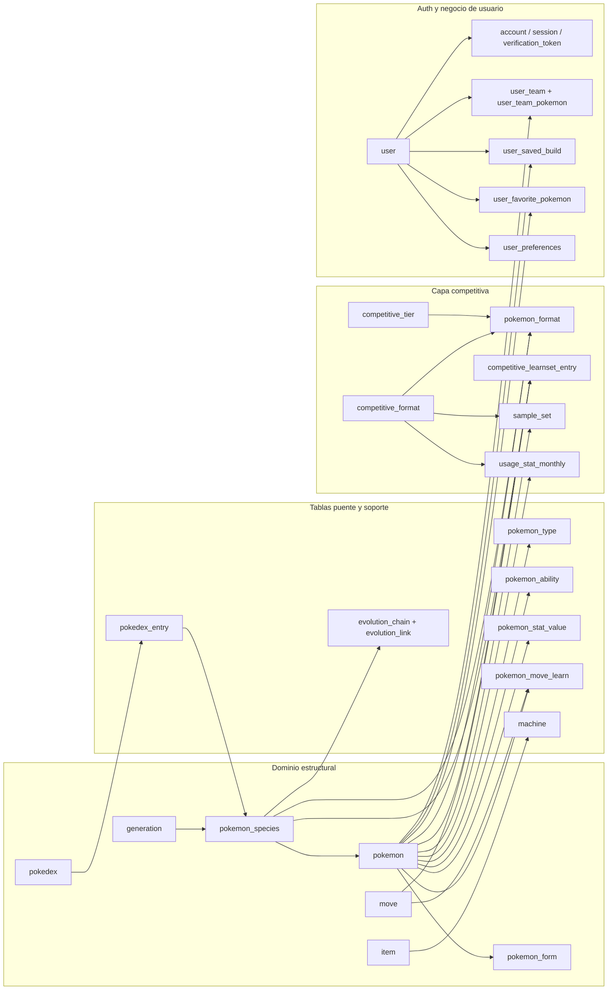
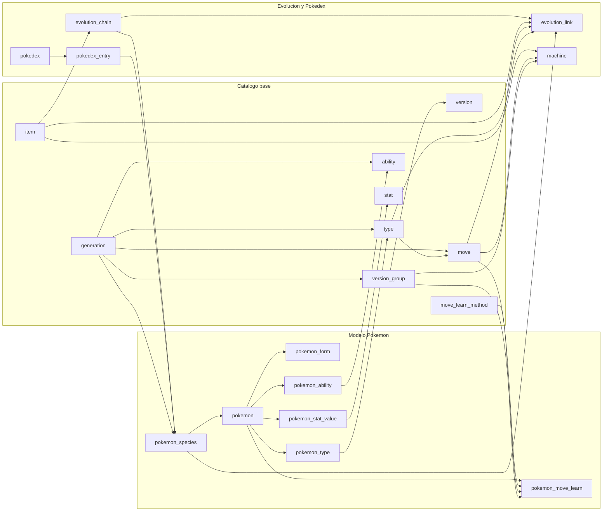
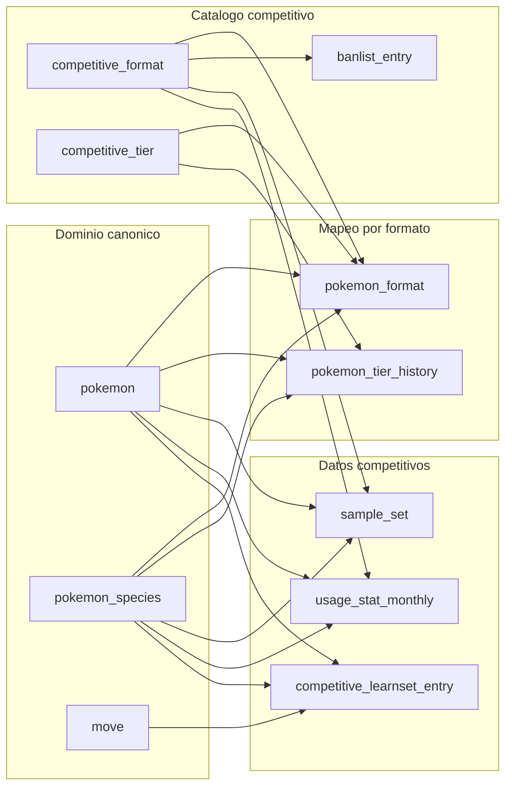
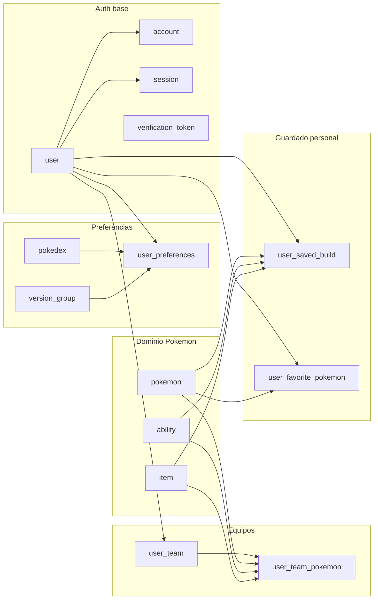

# Base de datos

## Objetivo del modelo

La base se ha disenado para separar tres dominios:

- estructura principal de Pokemon
- capa competitiva
- capa futura de usuarios y autenticacion

La fuente estructural principal es PokeAPI. La fuente competitiva es Pokemon Showdown y Smogon.

## Nombres a distinguir

Hay dos conceptos distintos:

- nombre visible del recurso cloud: por ejemplo `pokemon-project-dev-db` o `pokemon-project-prod-db`
- nombre logico de la base PostgreSQL: en Neon free actualmente es `neondb`

En local, la base es `pokemon_project`.

## Vista general por dominios

Este diagrama prioriza legibilidad. No intenta mostrar cada cardinalidad exacta; su objetivo es que se vea rapido como esta organizada la base.

## Dominio principal Pokemon

Tablas principales:

- `generation`
- `version_group`
- `version`
- `pokemon_species`
- `pokemon`
- `pokemon_form`
- `type`
- `ability`
- `stat`
- `move`
- `move_learn_method`
- `machine`
- `evolution_chain`
- `evolution_link`
- `item`
- `pokedex`
- `pokedex_entry`

Tablas puente:

- `pokemon_type`
- `pokemon_ability`
- `pokemon_stat_value`
- `pokemon_move_learn`

Tablas con `rawPayload` relevante:

- `pokemon`
- `pokemon_species`
- `move`
- `ability`
- `item`
- `evolution_chain`
- `version_group`
- `pokedex`

## Mapa del dominio principal

## Capa competitiva

Tablas principales:

- `competitive_format`
- `competitive_tier`
- `pokemon_format`
- `pokemon_tier_history`
- `usage_stat_monthly`
- `sample_set`
- `banlist_entry`
- `competitive_learnset_entry`

## Diagrama de la capa competitiva

## Auth y capa de usuario

Tablas preparadas:

- `user`
- `account`
- `session`
- `verification_token`
- `user_team`
- `user_team_pokemon`
- `user_saved_build`
- `user_favorite_pokemon`
- `user_preferences`

## Diagrama de auth y negocio de usuario

## Views SQL de lectura

Las views se crearon para no depender siempre de joins complejos en DBeaver o en lecturas read-only:

| View | Uso |
| --- | --- |
| `pokemon_summary_view` | Resumen por Pokemon con stats pivotados, tipos y habilidad principal |
| `pokemon_move_learn_view` | Learnsets enriquecidos con movimiento, metodo y version |
| `pokemon_pokedex_entry_view` | Entradas de pokedex con Pokemon por defecto, artwork y tipos |
| `pokemon_competitive_overview_view` | Resumen competitivo por formato, tier y sample sets |

## Indices y claves importantes

- `pokemon.name`, `pokemon_species.name`, `move.name`, `ability.name`, `item.name`: `unique`
- `pokemon_type`, `pokemon_ability`, `pokemon_stat_value`: claves compuestas para evitar duplicados
- `pokemon_move_learn`: `unique` por Pokemon, movimiento, version, metodo y nivel
- `pokemon_format`: `unique` por formato y `showdownPokemonId`
- `usage_stat_monthly`: `unique` por formato, mes, rating y `showdownPokemonId`

## Limitacion conocida en cloud free

Las bases gratuitas en Neon no soportan el dataset completo de `usage_stat_monthly` dentro del limite de almacenamiento actual del proyecto. Por eso:

- local puede cargar el dataset completo
- cloud `develop` y `production` usan una carga ligera sin `usage_stat_monthly`

La parte estructural, los learnsets y los sample sets si quedan cargados en cloud.
